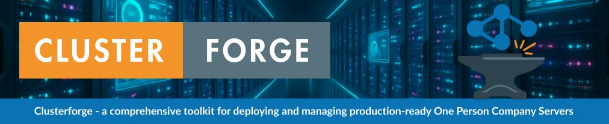

# 👋 Welcome to Clusterforge

<div align="center">



<br/>

---

<br/>


### Platform & Orchestration


### Data Persistence & Storage


### Automation & Data Integration


### Observability & Alerting


### Backup & Disaster Recovery


### Identity & Access Management


### Security & Network Protection


</div>

---

**Clusterforge** is your gateway to enterprise-grade infrastructure for one-person companies and small teams. It's a comprehensive toolkit that democratizes high-end server deployment and management, enabling solo entrepreneurs and small businesses to operate with the same technological advantages as large enterprises.

### 🎯 Purpose

- **Level the Playing Field**: Deploy and manage production-ready infrastructure that rivals enterprise setups
- **Reduce Complexity**: Automate complex server management tasks that typically require entire IT teams
- **Stay Competitive**: Access the same tools and capabilities used by larger companies, without the overhead
- **Focus on Business**: Spend less time on infrastructure and more time building your product

### 💪 Built for One-Person Companies

- **Zero-Team Operations**: Designed to be managed by a single person
- **Cost-Effective**: Enterprise features without enterprise costs
- **Time-Saving**: Automated deployment and maintenance
- **Production-Ready**: Battle-tested in real one-person company environments

---

## 🚀 What's Included

- **Core Infrastructure**
  - MicroK8s for lightweight Kubernetes orchestration
  - MetalLB for bare-metal load balancing
  - Cloudflare integration for DNS and TLS
  - MinIO for S3-compatible object storage
  - Harbor for private container registry (WIP)

- **Data & Integration**
  - PostgreSQL for reliable data storage
  - Redis for high-performance caching
  - Airbyte for data integration
  - MCP Airtable for AI-powered Airtable integration (WIP)
  - NoCodeAPI for API management (WIP)

- **Security & Identity**
  - Zitadel for modern IAM (WIP)
  - Fail2ban for brute-force protection
  - UFW & AppArmor for system hardening
  - Automated TLS certificate management

- **Automation & Workflow**
  - N8N workflow automation engine
  - Ntfy for notifications
  - Velero for backup and recovery (WIP)
  - Automated security updates

- **Monitoring & Observability**
  - Prometheus for metrics collection
  - Grafana for visualization (WIP)
  - Loki for log aggregation
  - System health monitoring (WIP)
  - Uptime Kuma for self-hosted uptime and status monitoring

---

## 🏃‍♂️ Quick Start 1-2-3

**TL;DR:**  
Clone, configure, and deploy your infrastructure in minutes.

1. **Clone & Setup**
   ```bash
   git clone https://github.com/The-One-Person-Company/clusterforge.git
   cd clusterforge
   cp env.template .env
   ```

2. **Configure Environment**
   ```bash
   # Edit your environment configuration
   nano .env
   ```

   Required configuration:
   ```env
   # DNS & TLS Configuration
   CLOUDFLARE_API_TOKEN=your_cloudflare_api_token_here
   DOMAIN_BASE=your_domain.com
   LETSENCRYPT_EMAIL=your_email@domain.com

   # Network Configuration
   METAL_LB_RANGE=192.168.1.240-192.168.1.250
   K8S_API_SERVER_IP=192.168.1.100

   # Storage Configuration
   MINIO_ROOT_USER=admin
   MINIO_ROOT_PASSWORD=change_this_password
   POSTGRES_PASSWORD=change_this_password
   
   # Additional configurations in .env.template
   ```

3. **Deploy**
   ```bash
   # Run the setup script
   bash setup-server.sh
   
   # Log out and back in, then run the installer
   bash install.sh
   ```

## ⚙️ Configuration Reference

The `.env` file controls all aspects of your deployment. Key configuration sections include:

### Core Configuration

- **DNS & TLS**
  - `CLOUDFLARE_API_TOKEN`: Your Cloudflare API token with Zone:Read and DNS:Edit permissions
  - `DOMAIN_BASE`: Your base domain (e.g., example.com)
  - `LETSENCRYPT_EMAIL`: Email for certificate notifications

- **Network**
  - `METAL_LB_RANGE`: IP range for load balancer (e.g., 192.168.1.240-192.168.1.250)
  - `K8S_API_SERVER_IP`: Kubernetes API server IP

### Service Credentials

- **Storage**
  - MinIO credentials
  - PostgreSQL credentials
  - Redis password

- **Applications**
  - N8N configuration
  - Zitadel admin setup
  - Airbyte credentials
  - Grafana admin access
  - Uptime Kuma domain and storage

### Security & Monitoring

- **Security**
  - SSH port configuration
  - Fail2ban settings
  - Backup retention policy

- **Resource Limits**
  - CPU and memory limits
  - Service-specific resources

#### Uptime Kuma

Add these variables to your `.env` for Uptime Kuma:

```env
# Uptime Kuma
UPTIME_KUMA_SUBDOMAIN=uptime
UPTIME_KUMA_STORAGE_SIZE=10Gi
UPTIME_KUMA_STORAGE_CLASS=fast
```

Uptime Kuma will be available at `https://$UPTIME_KUMA_SUBDOMAIN.$DOMAIN_BASE` after install.

#### Harbor

Add these variables to your `.env` for Harbor:

```env
# Harbor Configuration
HARBOR_SUBDOMAIN=harbor
HARBOR_STORAGE_SIZE=50Gi
HARBOR_STORAGE_CLASS=fast
HARBOR_ADMIN_PASSWORD=change_this_password
HARBOR_SECRET_KEY=your_secret_key_here_min_32_chars
HARBOR_DATABASE_HOST=postgres
HARBOR_DATABASE_PORT=5432
HARBOR_DATABASE_NAME=harbor
HARBOR_DATABASE_USER=harbor
HARBOR_DATABASE_PASSWORD=change_this_password
HARBOR_REDIS_HOST=redis
HARBOR_REDIS_PORT=6379
HARBOR_REDIS_PASSWORD=
```

Harbor will be available at `https://$HARBOR_SUBDOMAIN.$DOMAIN_BASE` after install.

- **Monitoring**
  - Real-time metrics
  - Custom Grafana dashboards
  - Alert management
  - Performance monitoring
  - Real-time metrics
  - Custom Grafana dashboards
  - Uptime Kuma status and uptime monitoring
  - Alert management
  - Performance monitoring

---

## 🛠 Prerequisites

- Ubuntu Server 24.04 LTS or newer
- Minimum System Requirements:
  - 4 CPU cores
  - 8GB RAM
  - 50GB storage
- Cloudflare account with API token
- Domain name configured with Cloudflare nameservers

---

## 🔒 Security Features

- **System Hardening**
  - Fail2ban for intrusion prevention
  - UFW firewall management
  - AppArmor MAC framework
  - Secure SSH configuration
  - Regular security patches
  - Network protocol hardening
  - System auditing framework

- **Access Control**
  - Role-based access control
  - Multi-factor authentication
  - JWT-based authentication
  - API key management

- **Network Security**
  - TLS everywhere
  - Automated certificate management
  - Network isolation
  - Service mesh security

---

## 🔧 Maintenance

- **Backup & Recovery**
  - Automated Velero backups
  - Point-in-time recovery
  - Backup verification
  - Disaster recovery plans

- **Updates & Upgrades**
  - Automated security patches
  - Kubernetes version management
  - Application updates via Helm
  - Zero-downtime upgrades

- **Monitoring**
  - Real-time metrics
  - Custom Grafana dashboards
  - Alert management
  - Performance monitoring

---

## 📝 License

Clusterforge is licensed under the GNU Affero General Public License v3.0 with Commons Clause.

### What this means:

✅ You can:
- Use Clusterforge for free, both personally and commercially
- Modify the code for your own use
- Study and learn from the code
- Share the unmodified code

✅ You must:
- Share any modifications you make to the code by submitting pull requests
- Keep all copyright notices and license information
- Make your source code available if you distribute the software
- Include the complete corresponding source code if you deploy modified versions

❌ You cannot:
- Sell Clusterforge or modified versions of it
- Offer Clusterforge as a commercial service
- Remove or modify the license terms

### Third-Party Licenses

Clusterforge helps you install and configure various third-party tools, each with their own licenses. Please refer to each tool's documentation for their specific license terms:

- Kubernetes/MicroK8s (Apache-2.0)
- PostgreSQL (PostgreSQL License)
- Redis (BSD-3-Clause)
- MinIO (AGPL-3.0)
- Prometheus (Apache-2.0)
- Grafana (AGPL-3.0)
- And others as documented in their respective repositories

For the complete license text, see the [LICENSE](LICENSE) file.

---

## 👥 Authors & Support

- **Vivien Roggero** - Founder & Developer
  - GitHub: [@VivienRg](https://github.com/VivienRg)
  - LinkedIn: [Vivien Roggero](https://linkedin.com/in/vivien-roggero)

### Support Channels

- 📧 Technical Support: [GitHub Issues](https://github.com/The-One-Person-Company/clusterforge/issues)
- 🐛 Bug Reports: [GitHub Issues](https://github.com/The-One-Person-Company/clusterforge/issues)
- 💬 Community: [Discussions](https://github.com/The-One-Person-Company/clusterforge/discussions)

---

## 📊 Project Status

- **Current Release**: v2.0.0 (Stable)
- **Maintained**: ✅ Active Development
- **Production Ready**: ✅ Used in Production

See our [Project Board](https://github.com/The-One-Person-Company/clusterforge/projects) for current development status and roadmap.

### Latest Updates

- Full Ubuntu 24.04 LTS support
- Enhanced security features with Fail2ban and AppArmor
- Improved backup system with Velero integration
- New monitoring dashboards

---

<div align="center">

### Clusterforge

*Secure, scalable, and automated Kubernetes infrastructure—future-proofed for modern cloud-native applications.*

<sub>Made with ❤️ by The One Person Company - Vivien Roggero LLC</sub>

</div> 